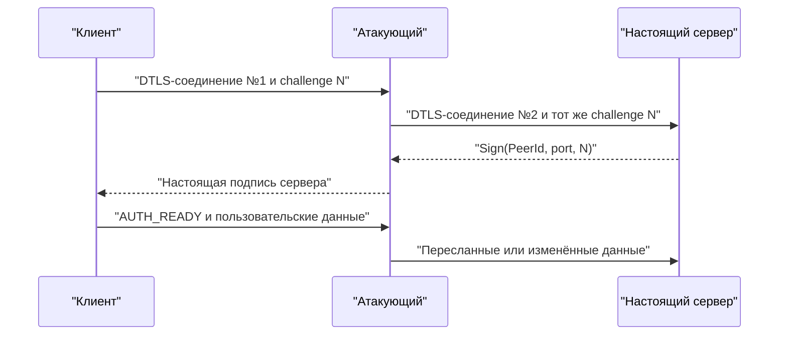

# Аудит безопасности go-p2p-netcat

Дата анализа: 5 августа 2026 года.

Проверенный commit: `8676929ced7b3c5fd2a3f60351d54007b1be7003`.

## Краткий вывод

Да, утилита условно уязвима для активной MitM-атаки через собственный транспорт Native WebRTC, когда он используется без pairing token.

- Обычные libp2p-соединения через TCP, QUIC, WebSocket, WebRTC Direct и Circuit Relay защищены Noise/TLS и привязаны к ожидаемому PeerId. При условии, что PeerId получен из доверенного источника, практической MitM-уязвимости в этом пути не обнаружено.
- В Native WebRTC сервер подписывает challenge, PeerId и логический порт, но не привязывает подпись к конкретному DTLS-каналу, его сертификату или fingerprint.
- Атакующий может создать два независимых DTLS-соединения, переслать challenge серверу и вернуть клиенту настоящую подпись сервера.
- Pairing token практически блокирует такого внешнего атакующего, потому что WebRTC-сигнализация защищается AES-GCM.
- Самая безопасная текущая конфигурация — pairing token вместе с `--no-webrtc`.

## Как проходит Native WebRTC MitM



Клиент успешно проверяет подпись настоящего PeerId, но эта подпись не доказывает, что клиент и сервер находятся в одном DTLS-канале.

Это видно в [`nativewebrtc/wire.go`](nativewebrtc/wire.go): подписываются домен, PeerId, service и challenge. В proof не входят:

- DTLS fingerprint;
- публичный ключ активного DTLS-сертификата;
- TLS/DTLS exporter;
- WebRTC session ID;
- offer/answer;
- роли клиента и сервера.

Клиентская проверка находится в [`nativewebrtc/endpoint.go`](nativewebrtc/endpoint.go), там же сервер подписывает полученный challenge. Native WebRTC по умолчанию участвует в гонке маршрутов в [`internal/cli/root.go`](internal/cli/root.go).

## Таблица векторов атак

| Вектор | Уязвима | Риск | Условия и результат |
|---|---:|---:|---|
| MitM обычного libp2p-соединения | Нет\* | Низкий | Noise/TLS аутентифицирует ожидаемый PeerId. `*` PeerId должен быть получен доверенным способом |
| Подмена PeerId до запуска | Да | Высокий | Если атакующий подменил PeerId в сообщении, документации или QR-коде, клиент безопасно соединится не с тем узлом |
| MitM Native WebRTC без pairing token | Да | Высокий | Подпись можно переслать между двумя DTLS-каналами; возможны чтение и изменение трафика |
| MitM Native WebRTC с pairing token | Практически нет | Низкий | Внешний атакующий не сможет сформировать корректное зашифрованное SDP-сообщение без токена |
| Кража pairing token | Да | Высокий | Токен является bearer credential: его владелец получает доступ до истечения или ротации |
| Неавторизованный PTY через `-i` | Да, без токена | Критический | Любой обнаруживший PeerId и порт участник получает интерактивную оболочку |
| Неавторизованный `-e` | Да, без токена | Критический | Команда задаётся оператором, но удалённый пользователь может управлять её stdin/stdout |
| SOCKS-прокси `-S` | Да, без токена | Высокий | Возможны open proxy, сканирование внутренней сети и доступ к локальным сервисам сервера |
| TCP/UDP forwarding | Да, без токена | Высокий | Удалённый участник получает доступ к назначенному оператором сервису |
| Flood WebRTC offers | Да | Высокий | Go listener создаёт goroutine и PeerConnection почти на каждый offer без глобального/per-peer лимита |
| Исчерпание памяти WebRTC-фреймами | Да | Средний/высокий | Очередь принятых данных может расти без верхней границы; злонамеренный peer может игнорировать flow-control |
| Огромное signaling JSON-сообщение | Частично | Средний | Для WebSocket signaling не установлен явный `ReadLimit` |
| SOCKS4 slowloris/огромное имя | Да | Средний | Поля SOCKS4 читаются до нулевого байта без разумного ограничения длины и read deadline |
| Replay admission handshake | Теоретически | Низкий | ClientHello можно повторить в пределах окна времени; libp2p и pairing-защита сильно ограничивают практическую эксплуатацию |
| DHT eclipse/censorship | Да | Средний | Злонамеренные DHT-узлы могут мешать обнаружению маршрута, но не могут подписаться приватным ключом ожидаемого PeerId |
| DHT-подмена сервера | Нет\* | Низкий | Результаты фильтруются по точному PeerId; возможны DoS и ложные адреса, но не криптографическая подмена |
| PubSub Sybil/flood | Частично | Средний | Общедоступный discovery topic позволяет создавать множество узлов и засорять discovery |
| Злоупотребление публичным relay | Частично | Средний | Relay может стать целью bandwidth/connection exhaustion; лимиты снижают, но не устраняют риск |
| Чтение трафика relay-оператором | Нет | Низкий | Relay видит PeerId, время и объём, но содержимое libp2p-трафика защищено end-to-end |
| Утечка identity/token-файла | Частично | Высокий | Новые identity-файлы создаются с `0600`, но права уже существующего файла и token-файла не проверяются |
| XSS в PWA | Не обнаружена | Низкий | CSP достаточно строгий, опасного `innerHTML` и хранения pairing token в localStorage не найдено |
| Уязвимые зависимости | Частично | Низкий runtime | В PWA найдена build-time зависимость `brace-expansion@5.0.8`; удалённой runtime-точки входа в готовой PWA не обнаружено |
| Компрометация релиза | Частично | Средний | Установщик проверяет SHA-256, но архив и checksum получаются из одного GitHub Release; криптографической подписи релиза нет |
| Анализ метаданных | Да | Средний для приватности | Signaling/DHT/relay могут раскрывать PeerId, факт соединения, время и объёмы трафика |

## Дополнительные подтверждённые проблемы

Go vulnerability scanner обнаружил применимую уязвимость [GO-2024-3218](https://pkg.go.dev/vuln/GO-2024-3218) в `go-libp2p-kad-dht@v0.42.1`. Она позволяет вредоносным DHT-узлам цензурировать результаты поиска. Исправленной версии в advisory пока не указано. Это проблема доступности и discovery, а не расшифровки защищённого libp2p-трафика.

В `web` используется `brace-expansion@5.0.8`, затронутый [GHSA-rgw5-rvv9-x895](https://github.com/advisories/GHSA-rgw5-rvv9-x895). В данном приложении зависимость приходит через инструменты сборки PWA, поэтому эксплуатация через обычного посетителя сайта маловероятна. Override следует обновить минимум до `5.0.9`.

## Что исправить в первую очередь

1. Привязать Native WebRTC proof к транспортному каналу: подписывать DTLS certificate fingerprint или результат DTLS exporter вместе с session ID, ролями, PeerId и логическим портом. Клиент должен сверять подписанный fingerprint с сертификатом реально активного соединения.

2. До исправления автоматически запрещать Native WebRTC без pairing token либо явно требовать флаг наподобие `--allow-unauthenticated-native-webrtc`.

3. Для `-i`, `-e`, `-S`, TCP/UDP forwarding требовать pairing token по умолчанию. Публичный режим должен включаться отдельным предупреждающим флагом.

4. Добавить лимиты:

   - максимальное число параллельных WebRTC handshakes;
   - лимит на один PeerId/IP;
   - ограниченную receive queue;
   - максимальный размер signaling-сообщения;
   - deadlines и пределы длины SOCKS4-полей.

5. Проверять права identity и pairing-token файлов; рекомендовать `0600` и отклонять небезопасные права.

6. Подписывать релизы через Sigstore/cosign или minisign, а не полагаться только на checksum из того же источника.

## Безопасный пример запуска

```bash
install -d -m 0700 ~/.config/p2p-netcat

p2p-nc id \
  --identity ~/.config/p2p-netcat/identity.key

p2p-nc token \
  --identity ~/.config/p2p-netcat/identity.key \
  --expires-in 3600 \
  32000 > ~/.config/p2p-netcat/shell.token

chmod 0600 \
  ~/.config/p2p-netcat/identity.key \
  ~/.config/p2p-netcat/shell.token

p2p-nc -l -k -i \
  --no-webrtc \
  --identity ~/.config/p2p-netcat/identity.key \
  --pairing-token-file ~/.config/p2p-netcat/shell.token \
  32000
```

Клиент:

```bash
p2p-nc \
  --no-webrtc \
  --pairing-token-file ~/.config/p2p-netcat/shell.token
```

`--no-webrtc` снижает возможности прохождения NAT, но исключает найденный уязвимый транспорт. Для соединения через NAT в таком режиме следует использовать доверенный Circuit Relay или прямой libp2p multiaddr.

## Проверка

Аудит включал:

- ручной анализ Go, JavaScript и PWA data flow;
- `go test ./...`;
- `go test -race -count=1 ./...`;
- `go vet ./...`;
- `govulncheck`;
- `gosec` с ручной проверкой результатов;
- тесты и lint `packages/core`;
- тесты, TypeScript/lint и production build `web`;
- `npm audit` для обоих JavaScript-пакетов.

Все тесты, race detector, vet и сборка прошли. Исходные файлы во время аудита не изменялись. Полноценный MitM PoC через публичные Nostr/WebTorrent-серверы не запускался; вывод о MitM основан на подтверждённом data flow и криптографически пересылаемом authentication transcript.
