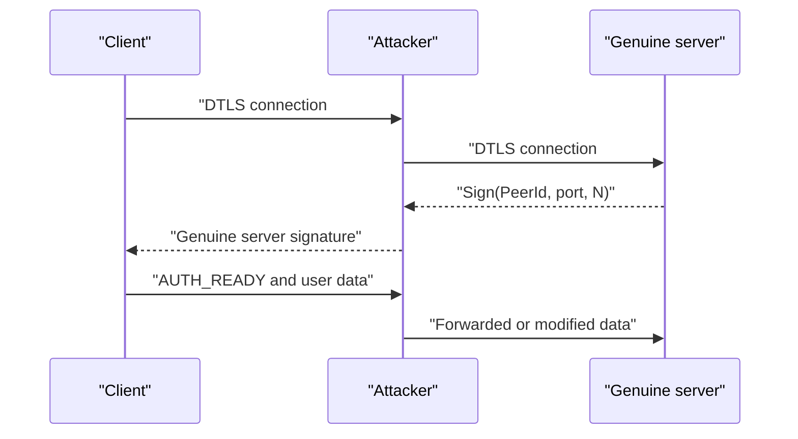

# go-p2p-netcat Security Audit

Audit date: August 5, 2026.

Audited commit: `8676929ced7b3c5fd2a3f60351d54007b1be7003`.

## Executive summary

The utility is conditionally vulnerable to an active man-in-the-middle attack through its custom Native WebRTC transport when that transport is used without a pairing token.

- Standard libp2p connections over TCP, QUIC, WebSocket, WebRTC Direct, and Circuit Relay are protected by Noise/TLS and bound to the expected PeerId. Provided that the PeerId was obtained from a trusted source, no practical MitM vulnerability was found in this path.
- In Native WebRTC, the server signs a challenge, PeerId, and logical port, but does not bind that signature to the specific DTLS channel, its certificate, or its fingerprint.
- An attacker can create two independent DTLS connections, forward the challenge to the server, and return the server's genuine signature to the client.
- A pairing token practically blocks an external attacker of this kind because WebRTC signaling is protected with AES-GCM.
- The safest current configuration combines a pairing token with `--no-webrtc`.

## How the Native WebRTC MitM attack works



The client successfully verifies the genuine PeerId signature, but that signature does not prove that the client and server are on the same DTLS channel.

This can be seen in [`nativewebrtc/wire.go`](nativewebrtc/wire.go): the signed material contains the domain, PeerId, service, and challenge. The proof does not include:

- the DTLS fingerprint;
- the active DTLS certificate's public key;
- a TLS/DTLS exporter value;
- the WebRTC session ID;
- the offer or answer;
- the client and server roles.

Client-side verification is implemented in [`nativewebrtc/endpoint.go`](nativewebrtc/endpoint.go), where the server also signs the received challenge. Native WebRTC participates in the default route race in [`internal/cli/root.go`](internal/cli/root.go).

## Attack-vector matrix

| Attack vector | Vulnerable | Risk | Conditions and impact |
|---|---:|---:|---|
| MitM against a standard libp2p connection | No\* | Low | Noise/TLS authenticates the expected PeerId. `*` The PeerId must be obtained through a trusted channel |
| PeerId substitution before launch | Yes | High | If an attacker replaces the PeerId in a message, document, or QR code, the client will securely connect to the wrong node |
| Native WebRTC MitM without a pairing token | Yes | High | The signature can be relayed between two DTLS channels, allowing traffic inspection and modification |
| Native WebRTC MitM with a pairing token | Practically no | Low | An external attacker cannot produce a valid encrypted SDP message without the token |
| Pairing-token theft | Yes | High | The token is a bearer credential; its holder gains access until expiration or rotation |
| Unauthorized PTY through `-i` | Yes, without a token | Critical | Any participant who discovers the PeerId and port can obtain an interactive shell |
| Unauthorized `-e` access | Yes, without a token | Critical | The command is selected by the operator, but a remote user can control its stdin and stdout |
| SOCKS proxy through `-S` | Yes, without a token | High | The service can become an open proxy and permit internal-network scanning or access to server-local services |
| TCP/UDP forwarding | Yes, without a token | High | A remote participant gains access to the service selected by the operator |
| WebRTC offer flood | Yes | High | The Go listener creates a goroutine and PeerConnection for nearly every offer without a global or per-peer limit |
| Memory exhaustion with WebRTC frames | Yes | Medium/high | The receive queue can grow without a hard bound; a malicious peer can ignore flow control |
| Oversized signaling JSON message | Partial | Medium | No explicit `ReadLimit` is configured for WebSocket signaling |
| SOCKS4 slowloris or oversized name | Yes | Medium | SOCKS4 fields are read up to a NUL byte without a reasonable length limit or read deadline |
| Admission-handshake replay | Theoretical | Low | ClientHello can be replayed within the timestamp window; libp2p and pairing protection substantially limit practical exploitation |
| DHT eclipse or censorship | Yes | Medium | Malicious DHT nodes can interfere with route discovery but cannot sign as the expected PeerId without its private key |
| DHT server impersonation | No\* | Low | Results are filtered by exact PeerId; denial of service and false addresses remain possible, but not cryptographic impersonation |
| PubSub Sybil or flood attack | Partial | Medium | A public discovery topic permits the creation of many nodes and discovery pollution |
| Public-relay abuse | Partial | Medium | The relay can be targeted for bandwidth or connection exhaustion; configured limits reduce but do not eliminate the risk |
| Traffic inspection by a relay operator | No | Low | The relay observes PeerIds, timing, and volume, but libp2p payloads are end-to-end encrypted |
| Identity or token-file disclosure | Partial | High | New identity files are created with mode `0600`, but permissions on an existing identity file or token file are not checked |
| PWA cross-site scripting | Not found | Low | The CSP is reasonably strict; no dangerous `innerHTML` use or pairing-token storage in localStorage was found |
| Vulnerable dependencies | Partial | Low at runtime | The PWA contains the build-time dependency `brace-expansion@5.0.8`; no remote runtime entry point was found in the built PWA |
| Release compromise | Partial | Medium | The installer verifies SHA-256, but the archive and checksum come from the same GitHub Release; releases are not cryptographically signed |
| Metadata analysis | Yes | Medium for privacy | Signaling, DHT, and relay infrastructure may expose PeerIds, connection timing, and traffic volume |

## Additional confirmed issues

The Go vulnerability scanner reported the applicable vulnerability [GO-2024-3218](https://pkg.go.dev/vuln/GO-2024-3218) in `go-libp2p-kad-dht@v0.42.1`. It allows malicious DHT nodes to censor lookup results. The advisory does not currently identify a fixed version. This affects availability and discovery rather than decryption of protected libp2p traffic.

The `web` package uses `brace-expansion@5.0.8`, which is affected by [GHSA-rgw5-rvv9-x895](https://github.com/advisories/GHSA-rgw5-rvv9-x895). In this application, the package is pulled in through PWA build tooling, so exploitation by an ordinary website visitor is unlikely. The override should be updated to at least `5.0.9`.

## Highest-priority remediation

1. Bind the Native WebRTC proof to the transport channel: sign the DTLS certificate fingerprint or a DTLS exporter value together with the session ID, roles, PeerId, and logical port. The client must compare the signed fingerprint with the certificate used by the active connection.

2. Until that is fixed, automatically disable Native WebRTC when no pairing token is supplied, or require an explicit flag such as `--allow-unauthenticated-native-webrtc`.

3. Require a pairing token by default for `-i`, `-e`, `-S`, and TCP/UDP forwarding. Public operation should require a separate warning flag.

4. Add limits for:

   - the maximum number of concurrent WebRTC handshakes;
   - the number of handshakes per PeerId or IP address;
   - the receive queue;
   - the maximum signaling-message size;
   - SOCKS4 field lengths and read deadlines.

5. Check identity and pairing-token file permissions, recommend mode `0600`, and reject unsafe permissions.

6. Sign releases using Sigstore/cosign or minisign instead of relying solely on a checksum obtained from the same source as the archive.

## Secure launch example

```bash
install -d -m 0700 ~/.config/p2p-netcat

p2p-nc id \
  --identity ~/.config/p2p-netcat/identity.key

p2p-nc token \
  --identity ~/.config/p2p-netcat/identity.key \
  --expires-in 3600 \
  32000 > ~/.config/p2p-netcat/shell.token

chmod 0600 \
  ~/.config/p2p-netcat/identity.key \
  ~/.config/p2p-netcat/shell.token

p2p-nc -l -k -i \
  --no-webrtc \
  --identity ~/.config/p2p-netcat/identity.key \
  --pairing-token-file ~/.config/p2p-netcat/shell.token \
  32000
```

Client:

```bash
p2p-nc \
  --no-webrtc \
  --pairing-token-file ~/.config/p2p-netcat/shell.token
```

The `--no-webrtc` option reduces NAT-traversal capability but removes the identified vulnerable transport. When connecting through NAT in this mode, use a trusted Circuit Relay or a direct libp2p multiaddr.

## Verification

The audit included:

- manual analysis of Go, JavaScript, and PWA data flows;
- `go test ./...`;
- `go test -race -count=1 ./...`;
- `go vet ./...`;
- `govulncheck`;
- `gosec` with manual triage of its results;
- tests and linting for `packages/core`;
- tests, TypeScript/lint checks, and a production build for `web`;
- `npm audit` for both JavaScript packages.

All tests, the race detector, vet, and the build passed. Source files were not modified during the audit. A complete MitM proof of concept against public Nostr/WebTorrent servers was not executed; the MitM conclusion is based on confirmed data flow and a cryptographically relayable authentication transcript.
